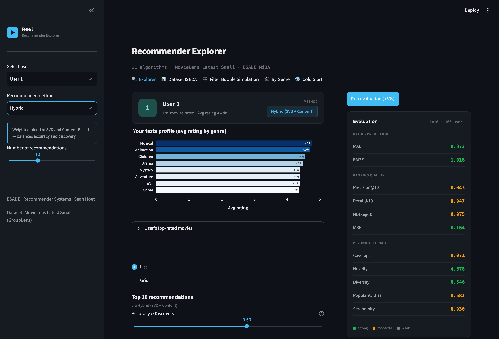

# MovieLens Recommender Prototype

### Live demo: [movielens-recommender-prototype.streamlit.app](http://movielens-recommender-prototype.streamlit.app/)

> Hosted on Streamlit's free tier, so the app sleeps after a period of inactivity. If you land on a "Zzzz" screen, click **"Yes, get this app back up!"** — it wakes in about 30 seconds.



---

A web app that recommends movies to users based on their past ratings, and lets you compare 11 recommendation algorithms against each other on the same user. Built as an individual project for the Recommender Systems course at ESADE MiBA.

## What it does

You pick a user from the MovieLens dataset and a recommendation algorithm, and the app shows you their top 10 personalised movie recommendations — along with posters, scores, and a summary of how well the algorithm performed.

You can switch between algorithms to compare them side by side, which is the main point of the prototype.

## Algorithms included

Eleven in total, from trivial baselines up to a hybrid — the baselines are there on purpose, as the floor every real algorithm has to beat.

| Algorithm | How it works |
|---|---|
| Random | Uniform random from the unseen catalogue — the accuracy floor |
| User Average | Predicts each user's own mean rating for everything |
| Item Average | Predicts each movie's mean rating across all users |
| Top-N (Most Popular) | Recommends the most-rated movies overall |
| Bayesian Weighted Rating | Like Top-N, but adjusts for movies with very few ratings |
| Product Associations | Co-occurrence: "people who watched this also watched…" |
| User-Based CF | Finds users with similar taste and recommends what they liked |
| Item-Based CF | Finds movies similar to ones you've already rated highly |
| Content-Based | Matches movies on genres and tags |
| Matrix Factorisation | Learns latent factors in the ratings matrix (SVD) |
| Hybrid | Weighted blend of SVD + Content-Based, with a tunable accuracy ↔ discovery dial |

## Evaluation

Every algorithm is scored on more than just accuracy, because a recommender that only optimises accuracy tends to recommend the same popular films to everyone:

- **Rating prediction** — MAE, RMSE
- **Ranking quality** — Precision@10, Recall@10, NDCG@10, MRR
- **Beyond accuracy** — Coverage, Novelty, Diversity, Popularity Bias, Serendipity

## Also in the app

- **Dataset & EDA** — ratings distribution, long-tail popularity, and the 98.3% sparsity of the user–item matrix
- **Filter Bubble Simulation** — simulates a user who watches *everything* the system recommends, five rounds deep, and tracks how the genre diversity of their feed collapses. Inspired by Eli Pariser's *The Filter Bubble* (2011)
- **By Genre** — Netflix-style personalised rows, one per genre
- **Cold Start** — simulates a user with only a handful of ratings and shows how each method copes

## Dataset

Uses the [MovieLens Latest Small](https://grouplens.org/datasets/movielens/latest/) dataset — 100,836 ratings from 610 users across 9,742 movies (98.3% sparse). Redistributed here under the GroupLens usage license; see `DATA/raw/README.txt`.

## How to run it locally

1. Install dependencies:
   ```
   pip install -r requirements.txt
   ```

2. Add your TMDB API key (for movie posters) to `.streamlit/secrets.toml`:
   ```
   TMDB_API_KEY = "your_key_here"
   ```
   Get a free key at [themoviedb.org](https://www.themoviedb.org/settings/api). The app still works without it — posters just won't load.

3. Start the app:
   ```
   streamlit run app.py
   ```

## Project structure

```
app.py              # Main Streamlit app
src/
  recommenders/     # One file per algorithm
  evaluation/       # Metrics (NDCG, precision, diversity, novelty, etc.)
  data/             # Data loading and preprocessing
DATA/raw/           # MovieLens CSV files
results/            # Pre-computed evaluation results (JSON)
```
